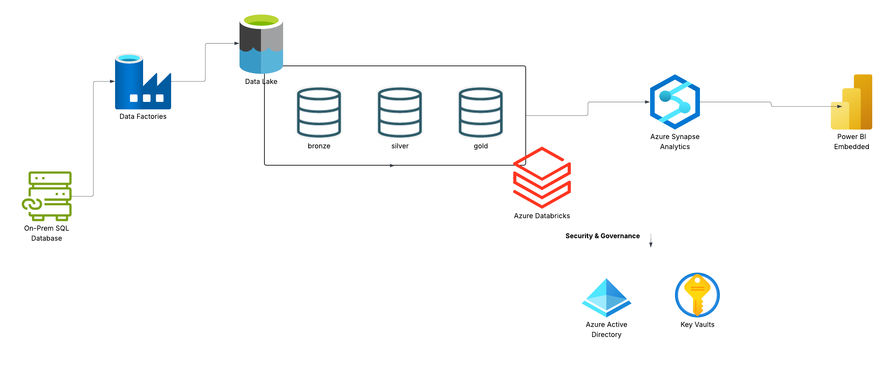
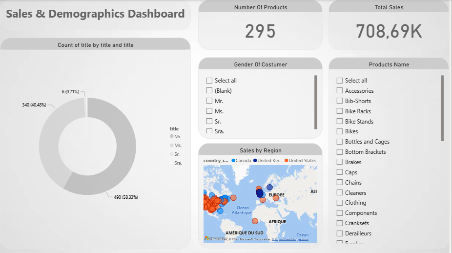

# 🚀 End-to-End Data Platform Project – AdventureWorks LT

This project showcases a full **modern data platform** implementation using Azure services and Databricks. It follows a multi-layered architecture (Bronze → Silver → Gold), supporting data engineering, transformation, and business intelligence via Power BI.

---

## 🧠 Project Highlights

- 🔁 **Data Lakehouse pipeline** using Databricks notebooks (Bronze, Silver, Gold layers)
- 🧱 **Structured processing** of `.bak` SQL Server backup data
- 📊 **Interactive Power BI dashboard** based on Gold-layer insights
- 🧾 Includes documentation, SQL scripts, and architectural overview

---

## 📐 Project Architecture

The following diagram illustrates the architecture and data flow of the platform:



---

## 📊 Power BI Dashboard

The final business insights are visualized in Power BI using data from the **Gold layer**:



> 📁 File: `power bi/Dashboard.pbix`

Includes:
- Sales performance
- Regional insights
- Product profitability
- Custom visuals with filters

---

## 📁 Project Structure

```bash
project-root/
├── databriks/                         # Notebooks for pipeline development
│   ├── bronze to silver - extended.ipynb
│   ├── silver to gold - extended.ipynb
│   └── storagemount.ipynb
│
├── dataset/                          # Raw database backup
│   └── AdventureWorksLT2017.bak
│
├── docs/                             # Project documentation
│   ├── Specification.docx
│   └── notes.docx
│
├── imgs/                             # Images for documentation and dashboard
│   ├── DATA_VIS.png
│   ├── dashboard.png
│   ├── databriks.png
│   ├── datalake.png
│   ├── project_architecture.png
│   └── synapse.png
│
├── power bi/                         # BI deliverables
│   ├── Dashboard.pbix
│   └── background.jpg
│
├── sql/                              # SQL scripts for setup and ETL
│   ├── createlogin.sql
│   ├── getschema.sql
│   ├── grantprivileges.sql
│   ├── insertproduct.sql
│   └── sp_CreateSQLServerlessView_gold.sql
│
└── README.md                         # Project overview
